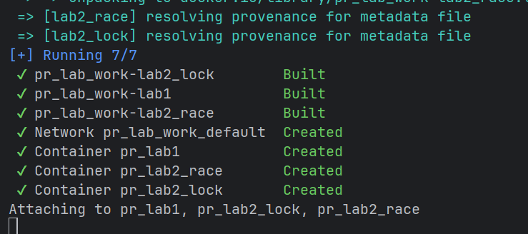

# Lab 2 — Concurrent HTTP Server (Threads)

**Discipline:** PR 

**Topic:** Thread‑per‑connection server 

**Focus:** Race condition vs mutex fix


---

## 1) Goals
- Accept multiple connections **concurrently** (thread‑per‑connection design).
- Maintain **per‑file request counters** stored in shared state.
- **Demonstrate a race condition** (no locking) and then **fix it** with a mutex.
- Compare behavior/performance with a **single‑thread baseline**.

---

## 2) Theory Recap
### Concurrency & shared state
- **Concurrency** allows overlapping work (e.g., serving multiple clients). Threads share memory; this makes communication cheap but introduces hazards.
- A **race condition** occurs when the correctness of a program depends on the timing of threads. In our case, two threads may read/update the same counter simultaneously and **lose updates**.
- The critical region is `counter[file] = counter[file] + 1`. Without exclusion, two increments can interleave like: `read 10 → read 10 → +1 → +1 → write 11` (should be 12).

### Mutual exclusion (mutex)
- A **mutex** (lock) ensures **only one** thread executes the critical section at a time: `lock → read → update → write → unlock`.
- This removes data races and guarantees counter correctness at the cost of potential contention.

### Throughput vs. latency (intuition)
- **Throughput** ↑ when we process requests in parallel (threads), until synchronization or CPU becomes a bottleneck.
- **Latency** may improve with parallelism, but mutex contention or heavy I/O can diminish gains. A small critical section keeps contention low.

---

## 3) Project Structure
```
lab2/
  Dockerfile
  docker-compose.yml

  # Servers
  server_single.py             # single‑thread baseline (Part I)
  server_threaded.py           # thread‑per‑connection — RACE (Part II)
  server_threaded_lock.py      # thread‑per‑connection — LOCK (Part II)
  server_rate_limited.py       # rate‑limited server (Part III)

  # Client / Load
  client.py                    # load generator: concurrency, requests, path

  # Static content
  content/
    index.html
    image.jpg
    books/
      crypto/
        *.pdf files
```

---

## 4) Quickstart (Docker)
**Prereqs:** Docker & Docker Compose.

```bash
# from repo root
cd lab2

# build & start all variants
docker compose up --build
```

**Endpoints**
- Single Thread: <http://localhost:8081/> (Part I)
- Race: <http://localhost:8082/> (Part II)
- Lock: <http://localhost:8083/> (Part II)
- Rate Limited: <http://localhost:8084/> (Part III)

**Health check**
- Test each server:

```bash
curl -i http://localhost:8081/
curl -i http://localhost:8082/
curl -i http://localhost:8083/
curl -i http://localhost:8084/
```

Stop:
```bash
docker compose down
```




---

## 5) Quickstart (Local, no Docker)
**Prereqs:** Python 3.11+

Terminal 1 — single thread (Part I):
```bash
python lab2/server_single.py
```

Terminal 2 — race condition (Part II):
```bash
python lab2/server_threaded.py
```

Terminal 3 — lock fix (Part II):
```bash
python lab2/server_threaded_lock.py
```

Terminal 4 — rate limited (Part III):
```bash
python lab2/server_rate_limited.py
```

**Ports:**
- Single: 8081
- Race: 8080 (threaded.py)
- Lock: 8080 (threaded_lock.py) 
- Rate Limited: 8084

---

## 6) Load Generator (client.py)
Run a local load to verify concurrency and race behavior.

**Arguments** (defaults shown):
```
--host localhost
--port 8082             # choose 8082 (RACE) or 8083 (LOCK)
--path /books/book1.txt
--concurrency 50
--requests 500
--timeout 5             # (if implemented) per request socket timeout
```

**Example:**
```bash
python lab2/client.py --port 8082 --concurrency 50 --requests 500
python lab2/client.py --port 8083 --concurrency 50 --requests 500
```


**Output (example):**


---

## 7) Lab Parts & Experiments

### **Part I: Performance Comparison**
Compare single-threaded vs multi-threaded performance:

```bash
# Test single-threaded (10 requests)
python client.py --port 8081 --concurrency 1 --requests 10

# Test multi-threaded (10 requests) 
python client.py --port 8080 --concurrency 10 --requests 10
```

**Expected Results:**
| Server Type | Concurrency | Requests | Time (s) | Throughput (req/s) |
|-------------|-------------|----------|----------|-------------------|
| Single      | 1           | 10       | ~10.0    | 1.0               |
| Multi       | 10          | 10       | ~1.0     | 10.0              |

### **Part II: Race Condition & Hit Counter**

**Race Condition Code (server_threaded.py lines 76-78):**
```python
old = REQUEST_COUNTERS.get(path, 0)
time.sleep(0.0005)  # widen race window  
REQUEST_COUNTERS[path] = old + 1
```

**Fixed Code (server_threaded_lock.py lines 72-74):**
```python
with LOCK:
    REQUEST_COUNTERS[path] = REQUEST_COUNTERS.get(path, 0) + 1
```

**Test Race Condition:**
```bash
python client.py --port 8080 --concurrency 50 --requests 500
# Check directory listing - counters will be wrong
```

**Test Fixed Version:**
```bash
python client.py --port 8080 --concurrency 50 --requests 500  
# Check directory listing - counters will be correct
```

### **Part III: Rate Limiting**

**Test Rate Limiting:**
```bash
# Spam requests (should get 429 after 10 requests)
python client.py --port 8084 --concurrency 20 --requests 100

# Test from different IP (simulate)
# Use different machine or VPN to test IP awareness
```

**Rate Limiting Stats:**
- Limit: 10 requests per 1 second per IP
- Response: 429 "Too Many Requests" when exceeded
- IP tracking: Each IP has separate limit


---

## 8) Implementation Notes
- **Parsing:** Minimal HTTP/1.0/1.1 parsing sufficient for static files; `Content-Type` inferred by extension.
- **Threading model:** Accept loop on a listening socket; **spawn a thread** per accepted connection.
- **Shared state:** `dict[str,int]` maps `path → request_count`.
- **Race variant:** increments without synchronization → non‑deterministic counters.
- **Lock variant:** `threading.Lock()` protects `counter[path]++`.
- **Graceful shutdown:** (optional) catch signals and dump counters.

---


